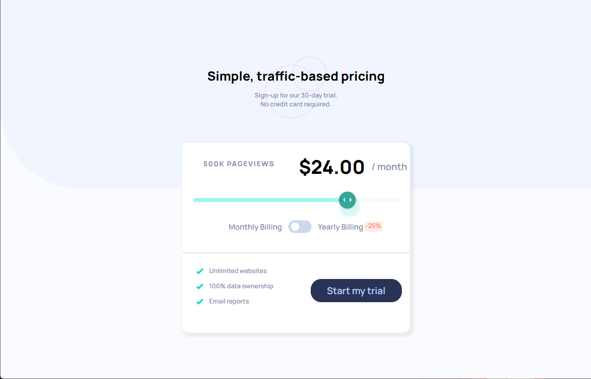
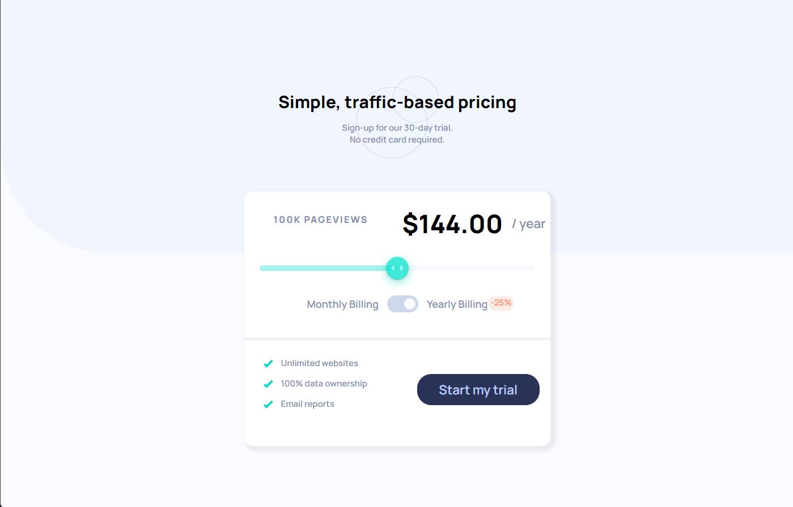
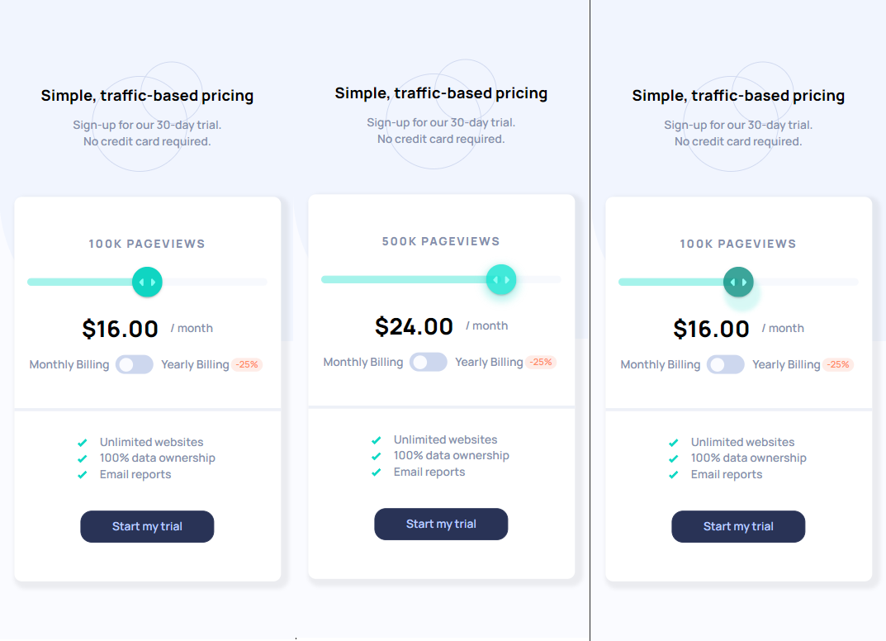

# Frontend Mentor - QR code component solution

This is a solution to the [Expenses chart component challenge on Frontend Mentor](https://www.frontendmentor.io/challenges/expenses-chart-component-e7yJBUdjwt/hub/expenses-chart-component-XCDivY5Qfz). Frontend Mentor challenges help you improve your coding skills by building realistic projects. 

## Table of contents

- [Overview](#overview)
  - [Screenshot](#screenshot)
  - [Links](#links)
- [My process](#my-process)
  - [Built with](#built-with)
  - [What I learned](#what-i-learned)
  - [Continued development](#continued-development)
- [Author](#author)
- [Acknowledgments](#acknowledgments)


## Overview

### Screenshot
- Desktop view




- Mobile View



### Links

- Solution URL: https://github.com/mrxshinji/interactive-pricing
- Live Site URL: https://mrxshinji.github.io/interactive-pricing


## My process

### Built with

- Semantic HTML5 markup
- Flexbox
- Mobile-first workflow
- React

### What I learned

- First time using Material UI and started with sliders. Had alot of styling format issue due to depreciation until found a preffered one through documentation

```js
const StyledSlider = styled(Slider)(({ theme }) => ({
    width: "90%",
    height: 10,
    '& .MuiSlider-rail': {
        color: `hsl(224, 65%, 95%)`,
    },
    '& .MuiSlider-track': {
        color: `hsl(174, 77%, 80%)`,
    },
    '& .MuiSlider-thumb': {
        color: `hsl(174, 86%, 45%)`,
        height: 40,
        width: 40,
        backgroundImage: `url(${IconSlider})`,
        backgroundRepeat: `no-repeat`,
        backgroundPosition: `center`,
        '&:hover': {
            filter: `opacity(0.8)`,
            color: `hsl(174, 86%, 48%)`,
            boxShadow: `0px 5px 10px 5px hsla(174, 86%, 45%, .3)`
        },
        '&.Mui-focusVisible': {
        color: `hsl(174, 86%, 30%)`,
        boxShadow: `5px 15px 5px 5px hsla(174, 86%, 45%, .2)`,
        },
    },
}));
```

### Continued development

- Another experience gain for using react I suppose....

### Useful resources

- [https://stackoverflow.com/] - Provide alot of insight on centering item.
- [https://www.w3schools.com/] - Provide alot help on syntax and how to use each method

## Author

- Website - [https://github.com/mrxshinji]
- Frontend Mentor - [@mrxshinji](https://www.frontendmentor.io/profile/mrxshinji)

## Acknowledgments

- Alot of people and googling for me to first time learn React with Material UI to handle the slider styles...
